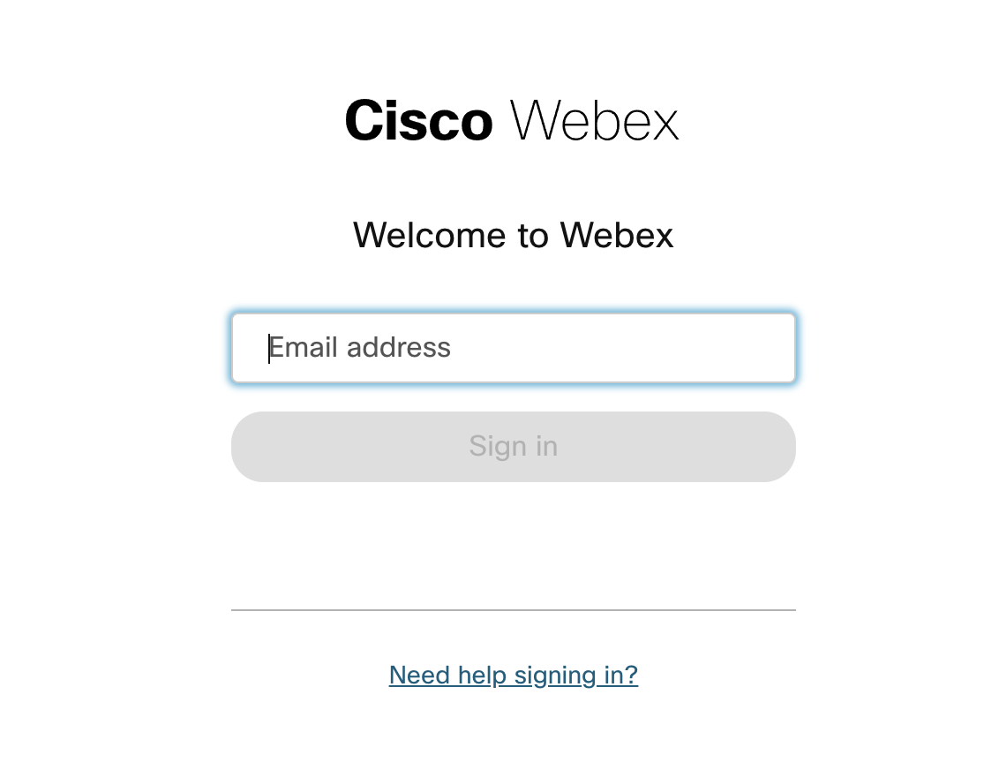
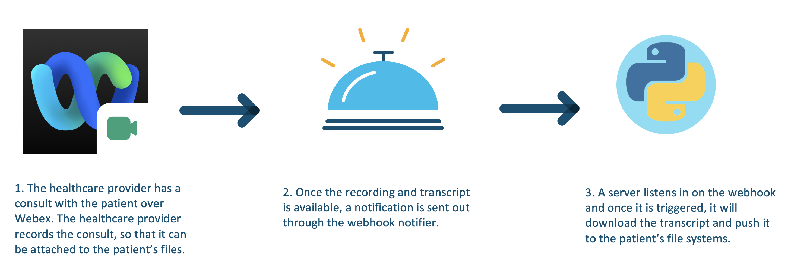
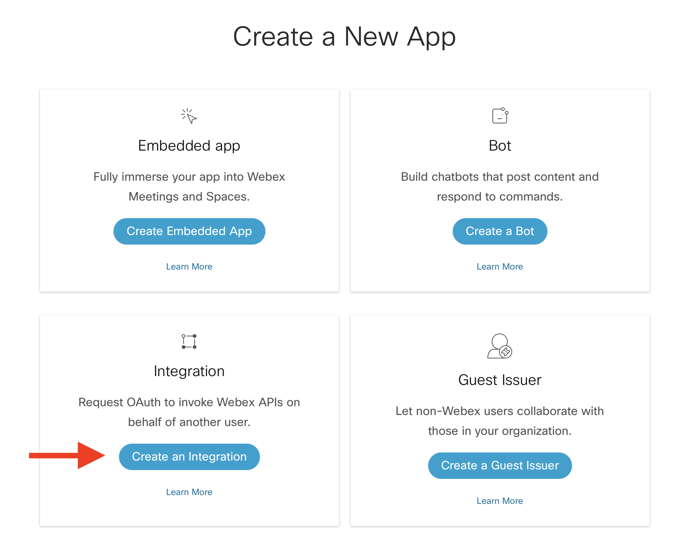
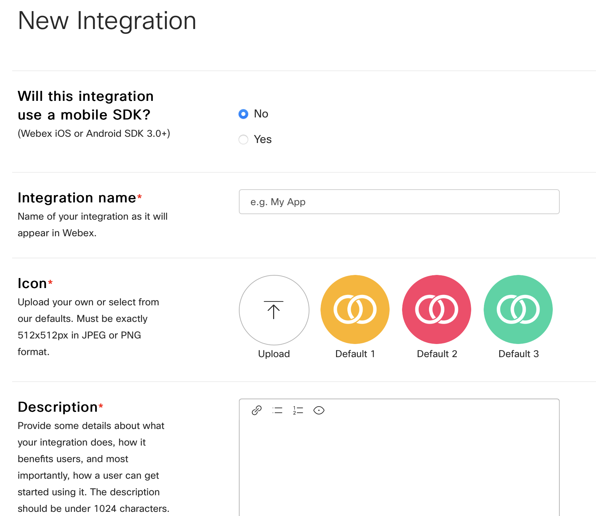

# GVE DevNet Webex Transcript Delivery
Cisco Webex is THE unified app for the future of work, where you can call, meet, collaborate and message. Webex allows you to record meetings if needed and the Webex cloud stores recordings and trascripts for up to one year. While the transcripts are available in the Webex cloud, some customers would like to have the transcript pushed to their Customer Relationship Management (CRM) systems right away. This use case is especially interesting for health care customers, who can add the transcripts of the recorded meetings to the patients' file systems, which enriches the patient data and it allows the health care provider to search through the previous patient meetings. Altogether, it allows the health care provider to provide even better care, because of the data completeness. 

In this Proof of Value (PoV), we have created a simple script that registers a webhook. Once a new recording becomes available, we fetch the transcript and we push this to a CRM of choice. For the demo, we have chose to push the transcript to Webex. In the section below, you will find a general overview of the process of the PoV:

1. Open the **Webex Transcript Delivery** application and login to Webex to retrieve a token:


2. You will be redirected to the Webex login page. Please login and authorize the **Webex Transcript Delivery** to retrieve recordings on your behalf: 



3. After successful authentication and authorization, the application will retrieve a token and you will be redirected to the following page: 


4. After having chosen the Webex space where you would like to send your message to, you will be redirected to the following page:


In the background, the application will continue to listen in on the webhook. Once a recording becomes available, then the webhook will trigger our application and we will start the process of retrieving the transcript. Please note that the transcript takes longer than the recording to be ready. A back-off script has been implemented in the script in order to wait an appropriate amount of time for the transcript to be ready. 

5. If you want to remove the webhook, then you can click the button **Remove webhook** and after it has been successfully removed, you will see the following page:


## Contacts
* Simon Fang (sifang@cisco.com)

## Solution Components
* Python
* Webex
* Flask
* Ngrok (optional)

## Prerequisites
* Webex OAuth Integration
* Webex Account
* Ngrok (optional)

## Flow
Below, you can find a diagram of the overall flow of the PoV:


And also a high-level overview of the design:


## How to register your own Webex OAuth integration
Registering an integration with Webex is easy and can be done in a couple of steps. If you have already registered your Webex OAuth integration with the right scopes, then you can skip this step.

1. First, head over to `developer.webex.com` and log in:


2. After having logged in, click on your avatar and select **My Webex Apps** from the menu under your avatar. 


3. On the new page, click **Create a New App** in the top right corner:


4. Then, click **Create an Integration** to start the wizard: 



5. In the wizard, fill in the form fields:

    * **Name:** The name of the app, e.g. My Webex Integration
    * **Icon:**: Choose an icon or upload an icon
    * **Description:** Explain what your integration can do. Note that these details are not displayed to the end-users of the integration
    * **Redirect URI(s):** Important! The Redirect URI has to match with the `webex_integration_redirect_uri` in the `.env` file. In our case, this will be `"http://127.0.0.1:5000/webexoauth"`
    * **Scopes:** We have to define the level of access that our integration requires. For our app, we require the following scopes: 

        * `meeting:schedules_read` 
        * `meeting:recordings_read`
        * `meeting:preferences_read` 
        * `spark-compliance:meetings_write` 
        * `spark:all`
        * `spark-compliance:webhooks_write`
        * `spark-compliance:webhooks_read`



6. After having filled in the details, click on `Add integration` and you will be taken to the next page, where you will be given the `Client ID` and `Client Secret` along with the OAuth Authorization URL. It is important to copy and store the `Client Secret` in a safe place as it will be generated and displayed only once for security purposes. In case you lose it, then a new client secret will be regenerated: 


> Note: the documentation for Webex integrations can be found [here](https://developer.webex.com/docs/integrations)

## How to obtain a Webex Bot Token

In order to send notifications to a Webex space, we have created a Webex Bot. Follow the following instructions to create a Webex bot and its token: 

1. Log in to `developer.webex.com`

2. Click on your avatar and select `My Webex Apps`

3. Click `Create a New App`

4. Click `Create a Bot` to start the wizard

5. Following the instructions of the wizard: fill in details such as the bot name, bot username and choose an icon

6. Click `Add Bot` and you will be given access token

7. Copy the access token and store it safely. Please note that the API key will be shown only once for security purposes. In case you lose the key, then you have to revoke the key and regenerate a new key

> For more information about Webex Bots and how to create one, please see the [documentation](https://developer.webex.com/docs/bots).

## Webex Room ID

You have to specify the Room ID of the Webex space and you have to add the Webex Bot to the room space as well. 

In order to obtain the Room ID, you have to make a GET request to the following endpoint: 

> https://webexapis.com/v1/rooms

The response will be a list of JSON objects, which are the spaces that the user is part of. Find the space that you would like to send the notifications to and copy the Room ID. 

> For more information about how to obtain a Webex Room ID, please consult the following resource [here](https://developer.cisco.com/site/webex-101/). 


## Ngrok
If you are testing locally, then you need to have a public ip that tunnels back to your local machine. There are many solutions that can provide this service. In this PoV, we have chosen **ngrok**. If you have not downloaded it yet, then follow the following instructions:

1. Install ngrok via Homebrew:

```
    $ brew install ngrok/ngrok/ngrok
```

or download the ZIP file via [their website](https://ngrok.com/download) and then unzip ngrok from the terminal:

```
    $ sudo unzip ~/Downloads/ngrok-stable-darwin-amd64.zip -d /usr/local/bin
```

2. Add authtoken (sign up if you don't have one):

```
    $ ngrok authtoken <token>
```

> For more information about the download instruction of ngrok, then head over to [their website](https://ngrok.com/download) 


## Installation/Configuration

The following commands are executed in the terminal.

1. Create and activate a virtual environment for the project:
   
        #WINDOWS:
        $ py -3 -m venv [add_name_of_virtual_environment_here] 
        $ source [add_name_of_virtual_environment_here]/Scripts/activate
        #MAC:
        $ python3 -m venv [add_name_of_virtual_environment_here] 
        $ source [add_name_of_virtual_environment_here]/bin/activate
        
> For more information about virtual environments, please click [here](https://docs.python.org/3/tutorial/venv.html)

2. Access the created virtual environment folder

        $ cd [add_name_of_virtual_environment_here]

3. Clone this repository

        $ git clone [add_link_to_repository_here]

4. Access the folder `GVE_DevNet_Webex_Transcript_Delivery`

        $ cd GVE_DevNet_Webex_Transcript_Delivery

5. Install the dependencies:

        $ pip install -r requirements.txt

6. Open the `.env` file and add the environment variables. In the sections above, it is explained how to obtain these credentials and variables. Please note that all the variables below are strings.

    ```python
    WEBEX_BOT_TOKEN = "<insert_webex_bot_token>"
    WEBEX_BOT_EMAIL = "<insert_webex_bot_email>"
    WEBHOOK_URL = "<insert_webhook_url>"

    WEBEX_INTEGRATION_CLIENT_ID = "<insert_webex_integration_client_id>"
    WEBEX_INTEGRATION_CLIENT_SECRET= "<insert_webex_integration_client_secret>"
    WEBEX_INTEGRATION_REDIRECT_URI = "http://127.0.0.1:5000/webexoauth"
    WEBEX_INTEGRATION_SCOPE = "meeting:schedules_read meeting:recordings_read meeting:preferences_read spark-compliance:meetings_write spark:all spark-compliance:webhooks_write spark-compliance:webhooks_read"
    ```


## Usage

Now is the time to launch the application! If you are testing locally, then you need to conduct one more step in between using `ngrok`. 

### Ngrok (local testing only)
Start an `ngrok` tunnel using the following command:

```
    $ ngrok http https://127.0.0.1:5000
```

You will obtain two public ip addresses. Copy the `https` address and paste that into the `WEBHOOK_URL` variable in the `.env` file.

### Webex Transcript Delivery Application
If you have the application running on a server exposed with a public IP address, then copy the `https` address and paste that into the `WEBHOOK_URL` variable in the `.env` file.

Now simply type in the following command in your terminal:

    $ python server.py

And head over to the following url:

```
https://127.0.0.1:5000
```

### LICENSE

Provided under Cisco Sample Code License, for details see [LICENSE](LICENSE.md)

### CODE_OF_CONDUCT

Our code of conduct is available [here](CODE_OF_CONDUCT.md)

### CONTRIBUTING

See our contributing guidelines [here](CONTRIBUTING.md)

#### DISCLAIMER:
<b>Please note:</b> This script is meant for demo purposes only. All tools/ scripts in this repo are released for use "AS IS" without any warranties of any kind, including, but not limited to their installation, use, or performance. Any use of these scripts and tools is at your own risk. There is no guarantee that they have been through thorough testing in a comparable environment and we are not responsible for any damage or data loss incurred with their use.
You are responsible for reviewing and testing any scripts you run thoroughly before use in any non-testing environment.